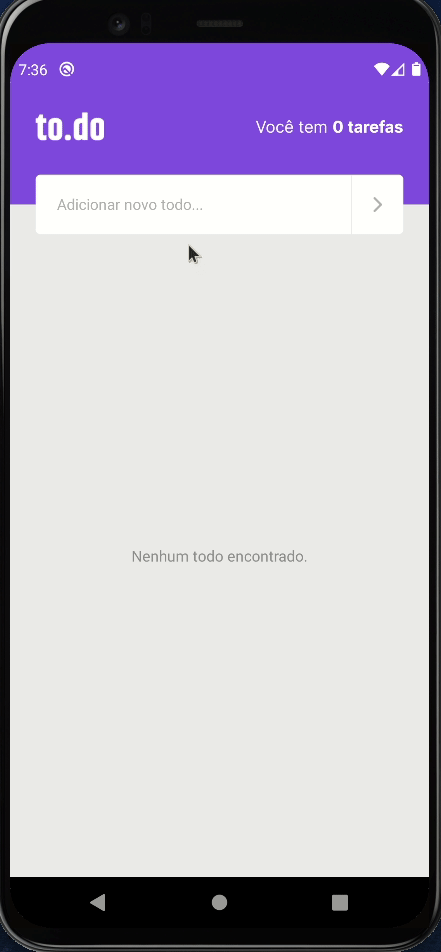

# MySkills

to.do is a task reminder app where you can add, remove, mark complete and edit tasks.

<p align="center">
  
</p>

## Tech Stack

- [React Native](https://reactnative.dev/)
- [TypeScript](https://www.typescriptlang.org)


## Installation

```
yarn
```
```
yarn android
```
```
yarn start
```
    